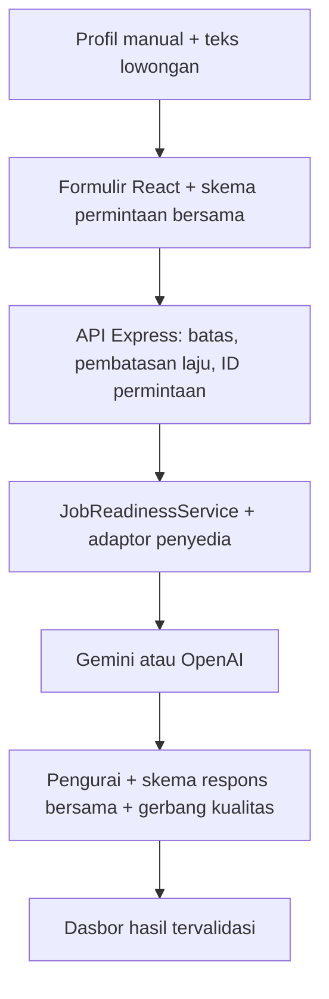

# LokerLens AI

[](https://github.com/sulujulianto/lokerlens-ai/actions/workflows/ci.yml)


[](LICENSE)

**Asisten kesiapan kerja berbasis AI dan bukti untuk pelamar pemula serta
vokasi di Indonesia.** LokerLens membandingkan profil kandidat yang diisi
secara manual dengan teks lowongan, kemudian menghasilkan penilaian kesiapan
terstruktur, bukti untuk setiap persyaratan, dan langkah perbaikan yang konkret.

> **Status rilis:** V2 merupakan kandidat pra-rilis yang telah diverifikasi
> secara lokal. Belum ada penerapan publik. Empat demo luring lengkap dapat
> digunakan tanpa kunci API; analisis langsung memerlukan konfigurasi Gemini atau
> OpenAI pada server.

[Jalankan secara lokal](#menjalankan-secara-lokal) ·
[Arsitektur](docs/ARCHITECTURE.md) ·
[Konteks produk](docs/PRODUCT_CONTEXT.md) ·
[Bukti verifikasi](#bukti-verifikasi) ·
[Persiapan penerapan](docs/DEPLOYMENT.md) ·
[Gerbang rilis](docs/RELEASE_CHECKLIST.md) · [Privasi](docs/PRIVACY.md)


## Asal dan Perkembangan Produk

LokerLens bermula sebagai proyek tantangan **Juara Vibe Coding** yang dibangun
dengan Google AI Studio dan Gemini. Sasaran awalnya adalah pencari kerja
Indonesia yang sedang memasuki bidang TI—lulusan SMK, lulusan bootcamp,
pengembang otodidak, dan pekerja yang beralih karier—yang dapat membaca
lowongan tetapi masih kesulitan menilai kesiapan, mengenali kesenjangan utama,
dan menentukan perbaikan yang harus diprioritaskan.

Pengisian profil secara manual merupakan keputusan produk yang disengaja, bukan
fitur unggah yang belum selesai. CV satu halaman sering memadatkan atau
menghilangkan pengalaman informal, proyek sekolah, konteks pelatihan, dan bukti
yang penting bagi penilaian pelamar pemula. Formulir terpandu meminta pengguna
menyampaikan bukti tersebut secara eksplisit dan tidak berpura-pura bahwa
pengurai CV dapat memulihkan fakta yang tidak pernah ditulis. Pengguna tetap
disarankan hanya memasukkan informasi yang relevan dengan lowongan tujuan.

V2 mempertahankan pendekatan berbasis bukti tersebut, kemudian memperluas
cakupan dari fokus awal bidang TI menjadi 29 rumpun karier dan menempatkan
Gemini serta OpenAI di balik satu batas server yang netral terhadap penyedia.
Lihat [Konteks dan dasar keputusan produk](docs/PRODUCT_CONTEXT.md) untuk
penjelasan mengenai cakupan awal, pertimbangan input manual, perkembangan dari
V1 ke V2, serta klaim yang sengaja tidak dibuat oleh produk.

## Mengapa Bukan Sekadar Pembungkus AI

- **Satu kontrak saat aplikasi berjalan.** Skema Zod ketat yang digunakan
  bersama memvalidasi permintaan dan respons pada peramban maupun
  server. Skema tersebut juga menegakkan total komponen skor, keselarasan
  skor dengan kesimpulan, batas ukuran bagian, dan struktur bukti wajib.
- **Sisi server netral terhadap penyedia dan sadar kegagalan.** Gemini dan OpenAI
  menerapkan satu antarmuka penyedia di belakang layanan aplikasi. Keluaran
  penyedia harus melewati ekstraksi JSON, validasi skema, dan gerbang kualitas
  bahasa Indonesia sebelum mencapai antarmuka. Batas waktu dan terputusnya koneksi
  peramban diteruskan sebagai sinyal pembatalan.
- **Batas kepercayaan dan privasi yang eksplisit.** Teks kandidat dan lowongan
  diperlakukan sebagai data instruksi model yang tidak tepercaya. Kunci API tetap
  berada pada server; galat publik tidak mengekspos instruksi model, keluaran
  mentah model, kredensial, detail SDK, atau jejak tumpukan galat.

## Alur Produk

1. Pilih satu dari 29 rumpun pekerjaan dan peran yang dituju.
2. Masukkan pendidikan, pengalaman formal atau informal, keterampilan, dan
   bukti melalui formulir manual terpandu.
3. Tempelkan teks lowongan yang dituju.
4. Jalankan analisis langsung atau buka salah satu dari empat demo luring
   deterministik.
5. Tinjau estimasi keselarasan 0–100, bukti persyaratan, kesenjangan, rencana
   30 hari, instruksi perbaikan CV, pesan lamaran, dan latihan wawancara.

Skor memperkirakan keselarasan dengan lowongan yang diberikan. Skor tersebut
**bukan** probabilitas diterima kerja, skor psikometrik, atau pengganti
pertimbangan perekrut.

## Ringkasan Arsitektur



Peramban hanya memanggil `/api/health` dan `/api/analyze`. Pemilihan penyedia,
konfigurasi model, dan kredensial tetap berada di balik batas server. Lihat
[dokumen arsitektur](docs/ARCHITECTURE.md) untuk siklus permintaan, batas
kepercayaan, lapisan kompatibilitas, dan kendala penerapan yang telah diketahui.

## Bukti Rekayasa Perangkat Lunak

| Area | Bukti yang diterapkan |
| --- | --- |
| Kontrak | Skema permintaan/respons Zod ketat yang digunakan bersama, lengkap dengan invarian lintas properti |
| Desain sisi server | Konfigurasi, adaptor penyedia, penyusun instruksi model, pengurai, gerbang kualitas, layanan, dan rute dipisahkan |
| Keamanan | Helmet, CSP produksi, Permissions Policy, batas badan permintaan 1 MB, ID permintaan, galat ternormalisasi, dan pembatasan laju per klien |
| Ketahanan | Konfigurasi tervalidasi, batas waktu penyedia, pembatalan permintaan, normalisasi kegagalan penyedia, penanganan penyedia tidak tersedia, dan tanpa mekanisme cadangan penyedia secara diam-diam |
| Pengujian | 28 berkas Vitest dengan 324 kasus uji deterministik, ditambah 9 skenario Playwright pada Chromium dan Firefox (18 eksekusi proyek), termasuk axe-core WCAG A/AA, tata letak responsif, papan ketik, dan pengurangan gerakan |
| Analisis statis | Pemeriksaan tipe TypeScript serta aturan ESLint untuk TypeScript, React Hooks, dan Vite Fast Refresh |
| CI | Pemeriksaan tipe, lint, pengujian dengan ambang cakupan, pembuatan paket produksi, E2E dan aksesibilitas Chromium/Firefox, serta audit dependensi produksi pada pengiriman commit (`push`) dan permintaan tarik (*pull request*) menuju `main` |

## Teknologi

| Lapisan | Teknologi |
| --- | --- |
| Antarmuka | React 19, TypeScript, Vite, Tailwind CSS, Motion, Lucide |
| Sisi server | Node.js, Express, Zod, Helmet, express-rate-limit |
| Batas AI | Adaptor Gemini dan OpenAI di balik antarmuka penyedia bersama |
| Pengujian | Vitest, Testing Library, jsdom, Playwright, Chromium, Firefox, axe-core |
| Pengiriman | GitHub Actions serta paket antarmuka dan server produksi |

## Bukti Visual

### Hasil terstruktur, bukan teks bebas dari model


### Bukti setiap persyaratan pada perangkat seluler


Seluruh tangkapan layar berasal dari aplikasi sebenarnya dengan data demo
luring fiktif. Tidak ada kunci API atau data pribadi pelamar di dalamnya.

## Menjalankan Secara Lokal

Persyaratan: Node.js 20.9 atau lebih baru dan npm.

```bash
git clone https://github.com/sulujulianto/lokerlens-ai.git
cd lokerlens-ai
npm ci
cp .env.example .env
npm run dev
```

Buka `http://localhost:3000`. Demo luring tidak memerlukan kunci API. Jika tidak
ada penyedia yang dikonfigurasi, `/api/health` melaporkan
`analysisAvailable: false`, analisis langsung dinonaktifkan, dan bagian lain
aplikasi tetap dapat digunakan.

Untuk analisis langsung dengan Gemini, simpan kredensial di `.env` dan jangan
pernah melakukan commit terhadap file tersebut:

```env
AI_PROVIDER=gemini
GEMINI_API_KEY=your_gemini_api_key_here
GEMINI_MODEL=gemini-3.5-flash
```

OpenAI juga didukung melalui `AI_PROVIDER=openai`, `OPENAI_API_KEY`, dan
`OPENAI_MODEL`. Tidak ada mekanisme cadangan diam-diam antarpenyedia.

## Bukti Verifikasi

Pemeriksaan berikut telah lulus pada kondisi commit `main` yang diaudit:

```bash
npm run typecheck  # Memeriksa tipe TypeScript tanpa menghasilkan berkas
npm run lint       # Menjalankan ESLint tanpa mengizinkan peringatan
npm run test:run   # 28 berkas, 324 kasus uji
npm run test:coverage  # Rangkaian yang sama dengan ambang cakupan V8
npm run build      # Membuat paket antarmuka dan server produksi
npx playwright install chromium firefox  # Instalasi peramban lokal satu kali
npm run test:e2e   # 9 skenario pada 2 peramban: 18 eksekusi proyek
npm run test:e2e:release-qa  # Dukungan terfokus untuk tata letak, papan ketik, dan gerakan
npm audit --omit=dev --audit-level=moderate
git diff --check
```

Rangkaian deterministik tidak memanggil penyedia AI eksternal. Evaluator Gemini
terpisah yang menjalankan delapan permintaan memeriksa integrasi langsung,
kesesuaian dengan bukti, validitas respons, variasi keluaran berulang, dan enam rumpun
pekerjaan. Evaluator tersebut sengaja tidak menjadi bagian CI karena memakai
kuota penyedia dan tetap bersifat nondeterministik. Satu proses evaluasi yang
tercatat menyelesaikan 8/8 permintaan tanpa peringatan otomatis, termasuk skenario
kuliner serta listrik/refrigerasi dwibahasa. Lihat
[catatan evaluasi](docs/EVALUATION.md).

Rangkaian pengujian deterministik juga menguji lowongan panjang dwibahasa dengan
pengalaman informal melalui validasi skema, pembuatan instruksi model, dan batas HTTP. Pengujian adaptor
terkontrol mencakup respons kosong, rusak, ditolak, melewati batas waktu, dan
kegagalan Gemini/OpenAI tanpa memakai kuota penyedia.

## Batas yang Diketahui dan Status Rilis

Repositori ini menunjukkan fondasi rekayasa pra-rilis yang kuat, bukan
kesiapan produksi. Sebelum V2 dirilis secara publik, masih diperlukan:

- pemilihan platform hosting dengan wilayah, pencatatan log, retensi, biaya,
  batas waktu,
  semantik proksi, dan perilaku pembatasan laju bersama yang telah diverifikasi;
- validasi penerapan untuk permintaan langsung yang memerlukan sekitar 24–37 detik
  pada evaluasi Gemini lokal yang tercatat;
- sampel penyedia langsung yang lebih luas daripada enam rumpun pekerjaan yang
  diamati, termasuk bukti integrasi langsung OpenAI;
- redaksi privasi khusus platform dan observabilitas produksi;
- cakupan lebih dalam untuk proses awal server, mode hosting penerapan, penampilan
  formulir kompleks, dan perilaku OpenAI langsung di luar ambang global 75%.

Bukti QA manual Chrome/Firefox, responsivitas, papan ketik, pengurangan gerakan,
pembesaran 200%, dan luapan tercatat pada dokumen QA manual. Penerapan tetap
menjadi gerbang terpisah dan tidak dilakukan oleh cabang repositori ini.

Pembatas laju berbasis memori bersifat lokal pada satu proses dan bukan kuota
global untuk penerapan dengan banyak instans. Tag GitHub stabil terbaru, `v1.0.0`,
merupakan edisi tantangan historis; V2 tetap menggunakan `2.0.0-dev` sampai
seluruh gerbang rilis terpenuhi.

## Dokumentasi

| Dokumen | Tujuan |
| --- | --- |
| [Konteks produk](docs/PRODUCT_CONTEXT.md) | Masalah awal, sasaran pengguna, alasan input manual terpandu, dan perkembangan V1 ke V2 |
| [Arsitektur](docs/ARCHITECTURE.md) | Komponen, siklus permintaan, batas kepercayaan, dan mode kegagalan |
| [Evaluasi](docs/EVALUATION.md) | Cakupan evaluasi langsung Gemini, hasil, dan batas klaim |
| [Privasi](docs/PRIVACY.md) | Batas aliran data saat ini dan hal yang harus ditinjau sebelum produksi |
| [Persiapan penerapan](docs/DEPLOYMENT.md) | Kontrak saat aplikasi berjalan yang netral terhadap penyedia, catatan keputusan, pemeriksaan uji terbatas, dan pemulihan |
| [Daftar periksa rilis](docs/RELEASE_CHECKLIST.md) | Gerbang berbasis bukti sebelum penerapan dan rilis |
| [QA manual](docs/MANUAL_QA.md) | Panduan pemeriksaan desktop, perangkat, papan ketik, gerakan, pembesaran, dan luapan oleh manusia |
| [Peta jalan](ROADMAP.md) | Fondasi yang telah selesai dan pekerjaan yang sengaja ditunda |
| [Catatan perubahan](CHANGELOG.md) | Perubahan historis dan perubahan yang belum dirilis |

## Lisensi

Dirilis berdasarkan [Lisensi MIT](LICENSE). Hak cipta © 2026 Sulu Edward
Julianto.
