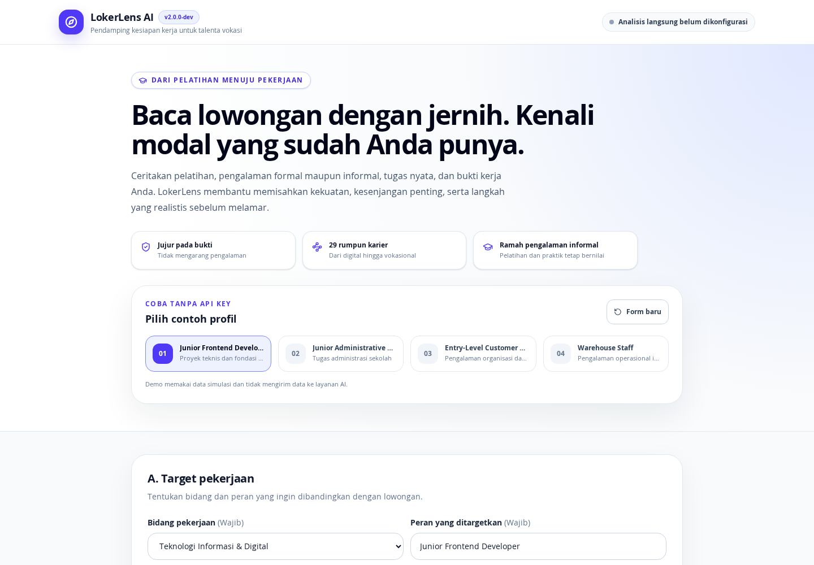
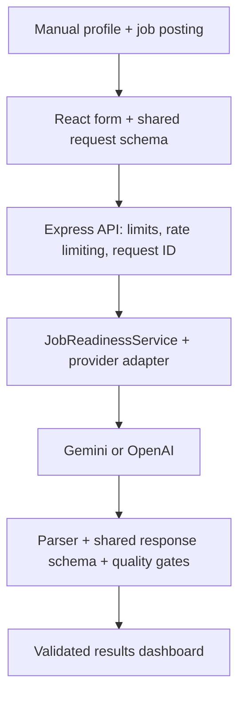
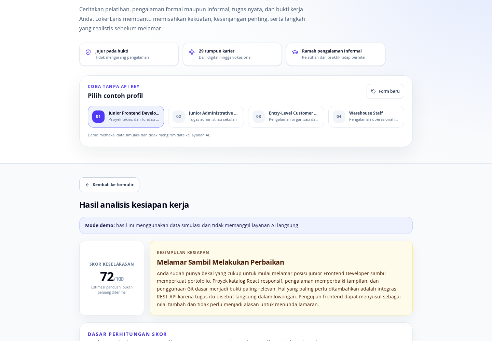
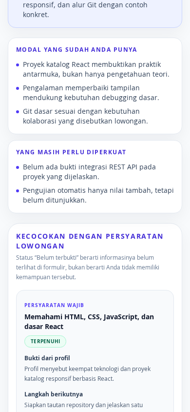

# LokerLens AI

[](https://github.com/sulujulianto/lokerlens-ai/actions/workflows/ci.yml)


[](LICENSE)

**An evidence-grounded AI job-readiness assistant for Indonesian entry-level
and vocational applicants.** LokerLens compares a manually entered candidate
profile with a job posting, then returns a structured readiness assessment,
requirement-by-requirement evidence, and concrete next steps.

> **Release status:** V2 is a locally verified pre-release candidate. There is
> no public deployment yet. Four complete offline demos work without an API
> key; live analysis requires a server-side Gemini or OpenAI configuration.

[Run locally](#run-locally) · [Architecture](docs/ARCHITECTURE.md) ·
[Verification](#verification-evidence) ·
[Release gates](docs/RELEASE_CHECKLIST.md) · [Privacy](docs/PRIVACY.md)



## Why this is more than an AI wrapper

- **One runtime contract across the stack.** Shared strict Zod schemas validate
  both requests and responses in the browser and server. They also enforce
  score-component totals, score/verdict alignment, bounded sections, and
  required evidence structures.
- **Provider-neutral, failure-aware backend.** Gemini and OpenAI implement one
  provider interface behind an application service. Provider output passes
  JSON extraction, schema validation, and Indonesian-language quality gates
  before it can reach the UI. Timeouts and browser disconnects propagate as
  cancellation signals.
- **Explicit trust and privacy boundaries.** Candidate and vacancy text are
  treated as untrusted prompt data. API keys stay server-side; public errors do
  not expose prompts, raw model output, credentials, SDK details, or stack
  traces.

## Product flow

1. Select one of 29 job families and a target role.
2. Describe education, formal or informal experience, skills, and evidence.
3. Paste the target job posting.
4. Run live analysis or open one of four deterministic offline demos.
5. Review a 0–100 alignment estimate, requirement evidence, gaps, a 30-day
   roadmap, CV-improvement prompt, application message, and interview practice.

The score estimates alignment with the supplied vacancy. It is **not** a hiring
probability, psychometric score, or substitute for recruiter judgment.

## Architecture at a glance



The browser only calls `/api/health` and `/api/analyze`. Provider selection,
model configuration, and credentials remain behind the server boundary. See
the [architecture document](docs/ARCHITECTURE.md) for the request lifecycle,
trust boundaries, compatibility layer, and known deployment constraints.

## Engineering evidence

| Area | Implemented evidence |
| --- | --- |
| Contracts | Shared strict Zod request/response schemas with cross-field invariants |
| Backend design | Configuration, provider adapters, prompt builder, parser, quality gates, service, and routes are separated |
| Security | Helmet, production CSP, Permissions Policy, 1 MB body limit, request IDs, normalized errors, and per-client rate limiting |
| Resilience | Validated configuration, provider timeouts, request cancellation, unavailable-provider handling, and no silent provider fallback |
| Testing | 24 test files and 286 deterministic tests across schemas, backend, API client, forms, demos, accessibility, interactions, and results |
| CI | Typecheck, tests, production build, and production-dependency audit on pushes and pull requests to `main` |

## Technology

| Layer | Stack |
| --- | --- |
| Frontend | React 19, TypeScript, Vite, Tailwind CSS, Motion, Lucide |
| Backend | Node.js, Express, Zod, Helmet, express-rate-limit |
| AI boundary | Gemini and OpenAI adapters behind a shared provider interface |
| Testing | Vitest, Testing Library, jsdom |
| Delivery | GitHub Actions, production frontend and server bundles |

## Visual evidence

### Structured result, not free-form model text



### Requirement-by-requirement evidence on mobile



All screenshots are captured from the real application using fictional offline
demo data. They contain no API key or personal applicant data.

## Run locally

Requirements: Node.js 20 or newer and npm.

```bash
git clone https://github.com/sulujulianto/lokerlens-ai.git
cd lokerlens-ai
npm ci
cp .env.example .env
npm run dev
```

Open `http://localhost:3000`. The offline demos do not need an API key. Without
a configured provider, `/api/health` reports `analysisAvailable: false`, live
analysis is disabled, and the rest of the application remains usable.

For live Gemini analysis, keep the credential in `.env` and never commit it:

```env
AI_PROVIDER=gemini
GEMINI_API_KEY=your_gemini_api_key_here
GEMINI_MODEL=gemini-3.5-flash
```

OpenAI is also supported through `AI_PROVIDER=openai`, `OPENAI_API_KEY`, and
`OPENAI_MODEL`. There is intentionally no silent fallback between providers.

## Verification evidence

The following checks passed on the audited `main` snapshot:

```bash
npm run lint       # TypeScript typecheck; ESLint is not configured yet
npm run test:run   # 24 files, 286 tests
npm run build      # Production frontend and server bundles
npm audit --omit=dev --audit-level=moderate
git diff --check
```

The deterministic suite does not call an external AI provider. A separate
six-request Gemini evaluation checks live integration, grounding, response
validity, and repeated-output spread; it is intentionally not part of CI
because it consumes provider quota and remains non-deterministic. See the
[evaluation notes](docs/EVALUATION.md).

## Known limits and release status

This repository demonstrates a strong pre-release engineering foundation, not
production readiness. Before a public V2 release it still needs:

- a chosen hosting platform with verified region, logging, retention, cost,
  timeout, and shared rate-limit behavior;
- real-browser E2E coverage and manual QA across desktop, mobile, keyboard-only,
  reduced-motion, and 200% zoom paths;
- live-provider evaluation for additional culinary and technical job families;
- deployment-specific privacy wording and production observability;
- a coverage report and enforced threshold if coverage becomes a release gate.

The in-memory rate limiter is process-local and is not a global quota for a
multi-instance deployment. The latest stable GitHub tag, `v1.0.0`, is the
historical challenge edition; V2 remains `2.0.0-dev` until its release gates
are satisfied.

## Documentation

| Document | Purpose |
| --- | --- |
| [Architecture](docs/ARCHITECTURE.md) | Components, request lifecycle, trust boundaries, and failure modes |
| [Evaluation](docs/EVALUATION.md) | Live Gemini evaluation scope, results, and non-claims |
| [Privacy](docs/PRIVACY.md) | Current data-flow boundaries and production review items |
| [Release checklist](docs/RELEASE_CHECKLIST.md) | Evidence-based gates before deployment and release |
| [Roadmap](ROADMAP.md) | Completed foundations and intentionally deferred work |
| [Changelog](CHANGELOG.md) | Historical and unreleased changes |

## License

Released under the [MIT License](LICENSE). Copyright © 2026 Sulu Edward
Julianto.
