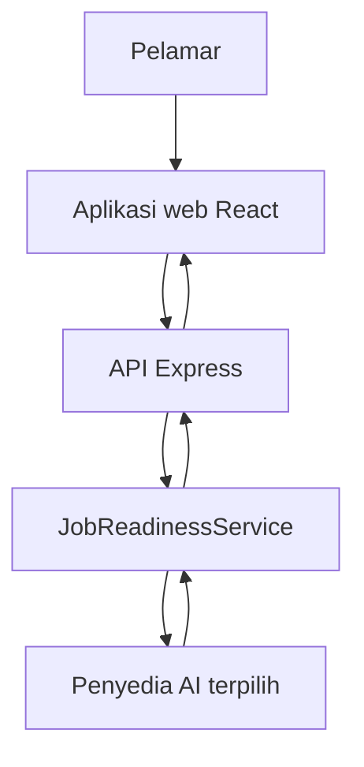
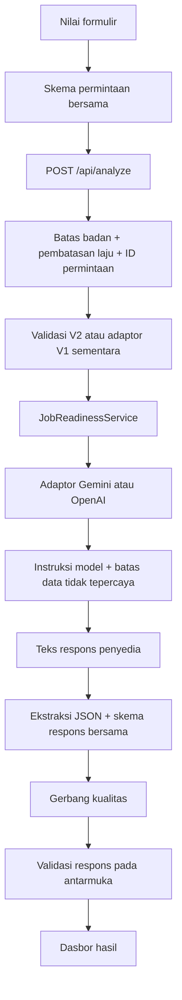

# Arsitektur LokerLens AI V2

Dokumen ini menjelaskan arsitektur yang diterapkan pada cabang `main`. Dokumen
ini merupakan peta implementasi, bukan klaim bahwa sistem telah siap produksi.

## Konteks Sistem

Aplikasi tidak menyimpan keadaan pengguna: tidak memiliki akun kandidat, basis
data, atau riwayat analisis. Peramban mengirim profil yang diisi secara manual dan teks
lowongan ke server hanya ketika analisis langsung diminta. Penyedia AI yang
dikonfigurasi kemudian memproses data tersebut sehingga kebijakan pencatatan
log dan retensi pada platform penerapan maupun penyedia tetap menjadi bagian batas
privasi.

Input manual juga merupakan batas produk yang berasal dari masalah awal, bukan
jalan pintas arsitektur. CV pelamar pemula sering tidak memuat pengalaman
informal, proyek sekolah, konteks pelatihan, dan bukti karena dipadatkan menjadi
satu halaman. LokerLens karena itu mengumpulkan properti terbatas sesuai tujuan,
bukan mengunggah atau menguraikan dokumen lalu menyimpulkan fakta yang hilang.
Sistem saat ini tidak memiliki batas unggah CV, OCR, pengurai CV, atau
penyimpanan berkas. Lihat [`PRODUCT_CONTEXT.md`](PRODUCT_CONTEXT.md) untuk
riwayat keputusan dan kompromi terkait.

## Siklus Permintaan

Peramban dan server mengimpor skema yang sama dari
[`../shared/analysisSchemas.ts`](../shared/analysisSchemas.ts). Pendekatan ini
mencegah pemeliharaan definisi kontrak antarmuka dan sisi server yang terpisah.

## Komponen dan Tanggung Jawab

### Inisialisasi dan Batas HTTP

[`../server.ts`](../server.ts) menangani pemuatan variabel lingkungan, konfigurasi
tervalidasi, resolusi penyedia, pengaturan hosting pengembangan atau produksi,
serta proses awal. [`../server/app.ts`](../server/app.ts) menyusun batas
aplikasi Express yang dapat diuji: batas badan JSON 1 MB, header keamanan, CSP
produksi, Permissions Policy, ID permintaan, pembatasan laju analisis, rute API,
kait hosting, dan penanganan galat ternormalisasi.

Proses dapat dimulai tanpa kunci API. Dalam keadaan tersebut `/api/health` tetap
tersedia tetapi mengembalikan `analysisAvailable: false`; demo luring tetap
berfungsi dan analisis langsung gagal secara aman.

### Konfigurasi

[`../server/config.ts`](../server/config.ts) memvalidasi:

- `AI_PROVIDER`: `gemini` atau `openai`;
- kunci API dan nama model penyedia;
- `PORT`, dengan nilai bawaan `3000`;
- `AI_REQUEST_TIMEOUT_MS`, dengan nilai bawaan `45000` dan batas 5–120 detik;
- `ANALYSIS_RATE_LIMIT_MAX`, dengan nilai bawaan `10`; serta
- `ANALYSIS_RATE_LIMIT_WINDOW_MS`, dengan nilai bawaan `60000` dan batas 10 detik–1
  jam.

Antarmuka hanya menerima penanda ketersediaan generik dan tidak mengetahui
penyedia atau model yang dipilih.

### Rute Analisis dan Batas Kompatibilitas

[`../server/routes/analyze.ts`](../server/routes/analyze.ts) terlebih dahulu
memvalidasi permintaan V2 ketat. Jika validasi gagal, rute mencoba adaptor
permintaan V1 sementara. Kedua jalur memakai layanan V2 yang sama. Klien V1
menerima respons lama yang dipetakan, sedangkan klien V2 menerima hasil V2
ternormalisasi.

Setiap permintaan memiliki `AbortController`. Terputusnya koneksi peramban
diteruskan melalui layanan menuju penyedia. Pembatas laju dijalankan sebelum
analisis untuk mengurangi pemakaian penyedia yang tidak disengaja atau
penyalahgunaan. Penyimpanan bawaan berada di memori dan bersifat lokal pada satu
proses sehingga bukan kuota global untuk penerapan dengan banyak instans.

### Layanan Aplikasi

[`../server/services/jobReadinessService.ts`](../server/services/jobReadinessService.ts)
tidak bergantung pada Express. Layanan menerima permintaan V2 yang telah
divalidasi, memanggil penyedia terpilih dengan sinyal pembatalan, dan
memvalidasi hasil sebelum mengembalikannya.

### Adaptor Penyedia

[`../server/ai/provider.ts`](../server/ai/provider.ts) mendefinisikan antarmuka
penyedia. Pemilih penyedia membuat tepat satu implementasi yang dikonfigurasi;
tidak ada mekanisme cadangan lintas penyedia secara diam-diam.

Adaptor Gemini:

- membuat klien SDK hanya ketika diperlukan;
- meminta JSON terstruktur menggunakan instruksi sistem dan instruksi pengguna;
- menerapkan batas waktu tervalidasi dan sinyal pembatalan;
- memetakan kegagalan menjadi galat aplikasi ternormalisasi; serta
- mengirim teks respons menuju pengurai bersama.

Adaptor OpenAI:

- menggunakan Responses API dengan Structured Outputs yang diturunkan dari
  skema Zod;
- menetapkan `store: false`;
- menormalisasi kegagalan HTTP, penolakan, respons tidak lengkap, dan keluaran
  kosong; serta
- menggunakan jalur batas waktu, pembatalan, dan pengurai yang sama dengan Gemini.

Penambahan penyedia ketiga memerlukan adaptor dan pengujian yang disengaja.
Konfigurasi saja tidak cukup.

### Instruksi Model dan Panduan Domain

[`../server/ai/promptBuilder.ts`](../server/ai/promptBuilder.ts) mendefinisikan
rubrik penilaian, kebijakan kesimpulan, batas keterikatan pada bukti, penanganan
persyaratan wajib dan
opsional, aturan peta jalan dan keluaran lamaran, serta batas eksplisit yang
memperlakukan teks kandidat/lowongan sebagai data tidak tepercaya.

[`../shared/jobFieldCatalog.ts`](../shared/jobFieldCatalog.ts) menjadi sumber
bersama untuk 29 rumpun pekerjaan dalam tujuh kelompok antarmuka.
[`../server/ai/jobFieldGuidance.ts`](../server/ai/jobFieldGuidance.ts)
menambahkan kompetensi khusus, contoh bukti, dan peringatan untuk 27 rumpun;
dua kategori terbuka memakai mekanisme cadangan konservatif.

### Penguraian dan Gerbang Kualitas

[`../server/ai/responseParser.ts`](../server/ai/responseParser.ts) menghapus
pagar blok kode Markdown opsional, melakukan penguraian JSON, dan memvalidasi
hasil lengkap dengan skema respons bersama. Properti yang tidak valid, hilang, berlebih, terlalu
besar, atau tidak konsisten secara internal akan ditolak.

Skema antara lain menegakkan invarian berikut:

- lima komponen skor harus berjumlah sama dengan skor akhir;
- rentang skor harus sesuai dengan pengenal kesimpulan stabil;
- setiap minggu pada peta jalan memiliki beberapa tindakan;
- kecocokan persyaratan memuat status, bukti, dan rekomendasi; serta
- hasil terstruktur memuat persiapan wawancara yang diwajibkan.

Gerbang kualitas tambahan menolak pelanggaran bahasa Indonesia tertentu,
seperti sapaan pembaca yang tidak konsisten serta klaim kelulusan pelatihan
atau sertifikasi yang tidak didukung bukti.

### Antarmuka

[`../src/api/analysisClient.ts`](../src/api/analysisClient.ts) memvalidasi ulang
respons API yang berhasil sebelum diterima komponen React. Komponen tidak
dimaksudkan untuk merender keluaran mentah penyedia.

Skenario luring pada [`../src/demoScenarios.ts`](../src/demoScenarios.ts)
menggunakan permintaan fiktif dan hasil V2 lengkap. Skenario melewati skema
yang sama tetapi tidak memanggil `/api/analyze` atau penyedia eksternal.

## Batas Kepercayaan dan Penanganan Data

| Batas | Kontrol |
| --- | --- |
| Peramban → API | Validasi permintaan bersama, batas properti, batas badan 1 MB, dan pembatasan laju |
| Teks pengguna → instruksi model | Pemisah data tidak tepercaya dan aturan keterikatan pada bukti yang eksplisit |
| Penyedia → aplikasi | Ekstraksi JSON, skema bersama ketat, invarian lintas properti, dan gerbang kualitas |
| Server → peramban | Kode/pesan galat publik stabil; tanpa keluaran mentah model, instruksi model, kunci API, detail SDK, atau jejak tumpukan galat |
| Konfigurasi → aplikasi | Validasi variabel lingkungan dan kredensial hanya pada server |

Basis kode tidak menyimpan data kandidat. Pernyataan tersebut tidak
mencakup log akses infrastruktur atau retensi penyedia; keduanya harus
diverifikasi untuk platform penerapan yang dipilih.

## Perilaku Kegagalan

- Kredensial penyedia tidak tersedia: server tetap dimulai; endpoint kesehatan
  melaporkan tidak tersedia; analisis langsung mengembalikan respons layanan tidak tersedia
  yang ternormalisasi.
- Permintaan tidak valid: ditolak sebelum penyedia dipanggil.
- Batas waktu penyedia atau koneksi peramban terputus: sinyal pembatalan
  diteruskan menuju permintaan penyedia.
- Keluaran model rusak atau tidak konsisten: ditolak sebelum mencapai
  antarmuka.
- Batas pembatasan laju terlampaui: mengembalikan `429`; penghitung bawaan diatur ulang saat
  proses dimulai ulang.
- Kegagalan server tak terduga: mengembalikan galat publik ternormalisasi tanpa
  nilai rahasia atau detail tumpukan panggilan.

## Batas Verifikasi

Vitest, Testing Library, penyedia palsu, fetch tiruan, jsdom, dan server HTTP
lokal sementara mencakup skema, modul sisi server, batas perangkat perantara
(*middleware*) dan rute Express
lengkap, kompatibilitas, perilaku klien, formulir, demo, hasil, aksesibilitas,
interaksi, dan penampilan hasil. Permintaan panjang dwibahasa dengan pengalaman
informal dipertahankan melalui validasi skema, pembuatan instruksi model, dan batas
HTTP. Pengujian adaptor Gemini dan OpenAI terkontrol menjalankan respons kosong,
rusak, ditolak, melewati batas waktu, serta kegagalan tanpa panggilan penyedia
eksternal. CI menegakkan cakupan V8 global 75% untuk pernyataan, cabang, fungsi,
dan baris.

Playwright kemudian menjalankan sembilan skenario pada Chromium dan Firefox
(18 eksekusi proyek) terhadap paket produksi. Tiga skenario mencakup proses awal tanpa
penyedia, perilaku demo luring, pengelolaan fokus, pengaturan ulang, dan pemeriksaan
luapan pada area tampilan seluler. Tiga skenario lain menggunakan axe-core untuk
aturan WCAG A/AA pada formulir awal dan hasil luring serta menjalankan pengaturan ulang
melalui papan ketik. Satu skenario mengemulasikan pengurangan gerakan dan
memeriksa indikator pemuatan, pengguliran, serta transisi. Dua skenario pendukung QA rilis memeriksa
penyesuaian tata letak formulir/hasil pada 360–768 CSS px dan perjalanan demo luring hanya
dengan papan ketik beserta pemulihan fokus sebelum audit dependensi produksi.

Paket produksi juga telah diperiksa secara lokal untuk perilaku kesehatan,
mekanisme cadangan SPA, header keamanan, penanganan penyedia tidak tersedia, dan
pembatasan laju. Evaluasi Gemini delapan permintaan yang tercatat memberikan bukti integrasi
langsung pada enam rumpun pekerjaan. Evaluasi selesai tanpa peringatan otomatis
dan mencakup skenario kuliner serta listrik/refrigerasi dwibahasa; lihat
[`EVALUATION.md`](EVALUATION.md).

Pemeriksaan tersebut **tidak** membuktikan kesiapan penerapan publik. Pembatasan laju
bersama, observabilitas penerapan, perilaku batas waktu produksi, integrasi langsung
OpenAI, dan peninjauan privasi khusus penerapan tetap menjadi gerbang rilis yang
terbuka. QA manual lintas peramban, perangkat, papan ketik, pengurangan gerakan,
pembesaran 200%, dan luapan telah dicatat pada
[`MANUAL_QA.md`](MANUAL_QA.md), tetapi perlu diulang jika penerapan atau
perubahan antarmuka material menghasilkan perilaku berbeda.
