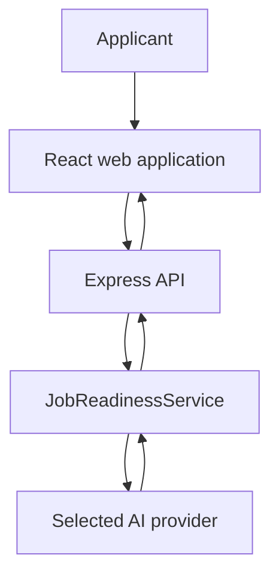
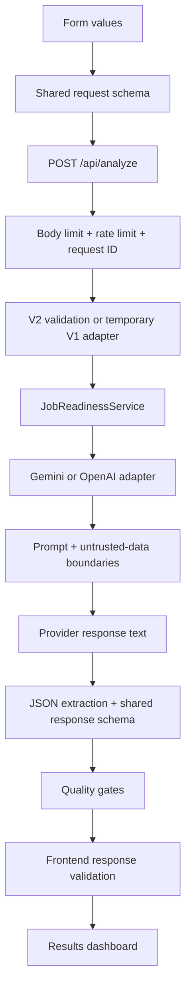

# LokerLens AI V2 Architecture

This document describes the architecture implemented on `main`. It is an
implementation map, not a claim that the system is production-ready.

## System context

The application is stateless: it has no candidate account, database, or
analysis history. The browser sends a manually entered profile and job posting
to the server only when live analysis is requested. The configured AI provider
then processes that data, so deployment and provider logging/retention policies
remain part of the privacy boundary.

## Request lifecycle

The browser and server import the same schemas from
[`../shared/analysisSchemas.ts`](../shared/analysisSchemas.ts). This avoids
maintaining separate frontend and backend definitions for the V2 contract.

## Components and responsibilities

### Bootstrap and HTTP boundary

[`../server.ts`](../server.ts) owns environment loading, validated
configuration, provider resolution, development or production hosting setup,
and process startup. [`../server/app.ts`](../server/app.ts) assembles the
testable Express application boundary: the 1 MB JSON body limit, security
headers, production CSP, Permissions Policy, request IDs, analysis rate
limiting, API routes, hosting hook, and normalized error handling.

The process may start without an API key. In that state `/api/health` remains
available but returns `analysisAvailable: false`; offline demos still work and
live analysis fails safely.

### Configuration

[`../server/config.ts`](../server/config.ts) validates:

- `AI_PROVIDER`: `gemini` or `openai`;
- provider API key and model name;
- `PORT`, default `3000`;
- `AI_REQUEST_TIMEOUT_MS`, default `45000` and bounded to 5–120 seconds;
- `ANALYSIS_RATE_LIMIT_MAX`, default `10`;
- `ANALYSIS_RATE_LIMIT_WINDOW_MS`, default `60000` and bounded to 10 seconds–1 hour.

The frontend receives only the generic availability flag; it does not learn
the selected provider or model.

### Analyze route and compatibility boundary

[`../server/routes/analyze.ts`](../server/routes/analyze.ts) first validates the
strict V2 request. If that fails, it attempts the temporary V1 request adapter.
Both paths use the same V2 service. A V1 caller receives a mapped legacy
response; a V2 caller receives the normalized V2 result.

Each request gets an `AbortController`. Browser disconnects propagate through
the service to the provider. The rate limiter executes before analysis to
reduce accidental or abusive provider spend. Its default store is in-memory
and process-local, so it is not a global quota in multi-instance deployments.

### Application service

[`../server/services/jobReadinessService.ts`](../server/services/jobReadinessService.ts)
is independent of Express. It accepts a validated V2 request, calls the
resolved provider with a cancellation signal, and validates the result before
returning it.

### Provider adapters

[`../server/ai/provider.ts`](../server/ai/provider.ts) defines the provider
interface. The resolver creates exactly one configured implementation; there is
no silent cross-provider fallback.

The Gemini adapter:

- creates the SDK client only when needed;
- requests structured JSON using system and user prompts;
- applies the validated timeout and cancellation signal;
- maps failures to normalized application errors;
- passes response text to the common parser.

The OpenAI adapter:

- uses the Responses API with Structured Outputs derived from the Zod schema;
- sets `store: false`;
- normalizes HTTP failure, refusal, incomplete response, and empty output;
- uses the same timeout, cancellation, and parser path as Gemini.

Adding a third provider requires a deliberate adapter and tests. Configuration
alone is not enough.

### Prompt and domain guidance

[`../server/ai/promptBuilder.ts`](../server/ai/promptBuilder.ts) defines the
scoring rubric, verdict policy, grounding constraints, must-have versus
nice-to-have handling, roadmap and application-output rules, and explicit
boundaries around candidate/vacancy text as untrusted data.

[`../shared/jobFieldCatalog.ts`](../shared/jobFieldCatalog.ts) is the shared
source for 29 job families in seven UI groups.
[`../server/ai/jobFieldGuidance.ts`](../server/ai/jobFieldGuidance.ts) adds
specialized competencies, evidence examples, and cautions for 27 families; two
open categories use a conservative fallback.

### Parsing and quality gates

[`../server/ai/responseParser.ts`](../server/ai/responseParser.ts) removes an
optional Markdown fence, parses JSON, and validates the complete result with
the shared response schema. Invalid, missing, extra, oversized, or internally
inconsistent fields are rejected.

The schema enforces, among other invariants:

- the five score components total the final score;
- score ranges agree with stable verdict identifiers;
- roadmap weeks contain multiple actions;
- requirement matches contain status, evidence, and a recommendation;
- the structured result contains the required interview preparation.

Additional quality gates reject selected Indonesian-language violations, such
as inconsistent reader address and unsupported training graduation or
certification claims.

### Frontend

[`../src/api/analysisClient.ts`](../src/api/analysisClient.ts) validates a
successful API response again before React components receive it. Components
never intentionally render raw provider output.

Offline scenarios in [`../src/demoScenarios.ts`](../src/demoScenarios.ts) use
fictional requests and complete V2 results. They pass through the same schemas
but do not call `/api/analyze` or an external provider.

## Trust boundaries and data handling

| Boundary | Control |
| --- | --- |
| Browser → API | Shared request validation, field bounds, 1 MB body limit, and rate limiting |
| User text → model prompt | Explicit untrusted-data delimiters and grounding rules |
| Provider → application | JSON extraction, strict shared schema, cross-field invariants, and quality gates |
| Server → browser | Stable public error codes/messages; no raw model output, prompt, key, SDK detail, or stack trace |
| Configuration → runtime | Environment validation and server-side-only credentials |

The codebase does not intentionally persist candidate data. That statement does
not cover infrastructure access logs or provider retention; those must be
verified for the selected deployment.

## Failure behavior

- Missing provider credentials: server starts; health reports unavailable;
  live analysis returns a normalized service-unavailable response.
- Invalid request: rejected before provider invocation.
- Provider timeout or browser disconnect: cancellation propagates to the
  provider request.
- Malformed or inconsistent model output: rejected before the frontend.
- Rate limit exceeded: returns `429`; default counters reset with the process.
- Unexpected server failure: returns a normalized public error without secret
  or stack details.

## Verification boundary

Vitest, Testing Library, fake providers, mock fetch, jsdom, and ephemeral local
HTTP servers cover schemas, backend modules, the complete Express middleware
and route boundary, compatibility, client behavior, forms, demos,
accessibility, interactions, and result rendering. CI enforces 75% global V8
coverage for statements, branches, functions, and lines. Playwright then runs
seven scenarios on both Chromium and Firefox (14 project runs) against the
production bundle. Three cover provider-unavailable startup, offline demo
behavior, focus management, reset behavior, and a mobile viewport overflow
check. Three more use axe-core on the initial form and offline result for WCAG
A/AA rules and exercise keyboard-driven reset. The seventh emulates reduced
motion and verifies that the loading spinner stops animating before the
production-dependency audit.

The production bundle has also been checked locally for health behavior, SPA
fallback, security headers, unavailable-provider handling, and rate limiting.
The recorded eight-request Gemini run provides live-integration evidence across
six job families. It completed without automated warnings and includes culinary
and bilingual electrical/refrigeration scenarios; see
[`EVALUATION.md`](EVALUATION.md).

These checks do **not** prove public deployment readiness. Broader manual
cross-browser and cross-device QA, complete keyboard-only review, reduced-
motion review beyond the spinner, 200% zoom review, shared rate limiting,
deployment observability, production timeout behavior, OpenAI live integration,
and deployment-specific privacy review remain open release gates.
